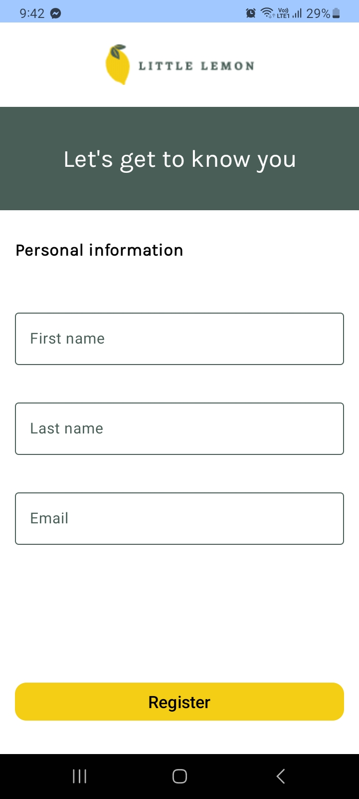
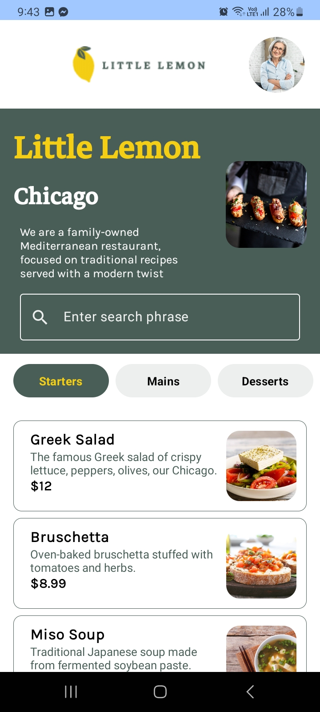
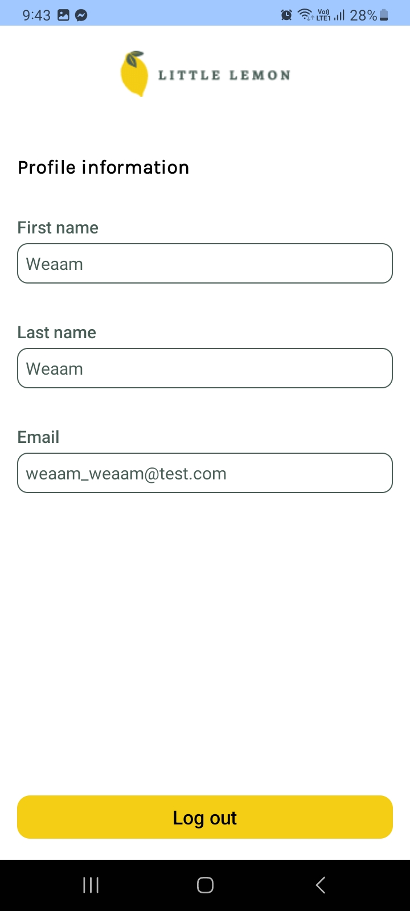

# Little Lemon Food Ordering App

This repository contains the code for the Little Lemon Food Ordering App, developed as part of the Android app capstone course. The app allows users to order food from the Little Lemon restaurant, providing a solution to a real-world problem. By completing this project, I have demonstrated the skills gained throughout the Android Developer Professional Certificate program.

## Skills Demonstrated

- Set up a Jetpack Compose application
- Commit a project to a Git repository
- Planned the UI and UX of the application using Figma
- Set up a navigation hierarchy between app screens
- Created a user onboarding flow
- Developed a food menu user interface
- Fetched data from a remote service using the Ktor library and stored it in local device storage using the Room library with SQL.
- Saved user's details using shared preferences

## Screenshots

